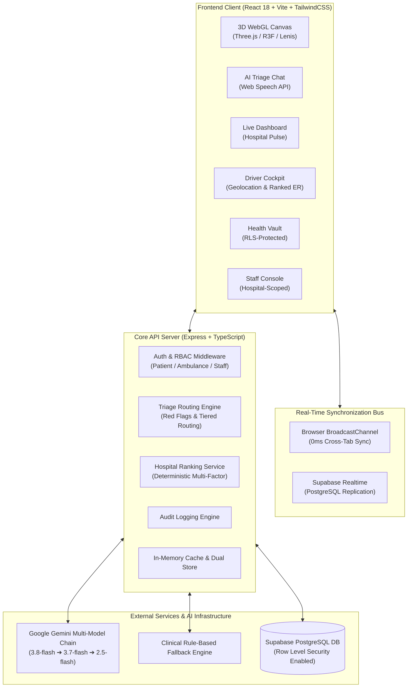

# MediSync AI (Curiousparc_ASTRA)

> **"Live hospital availability + AI triage, in one unified platform."**

> **"team members: Rushikesh Soni(team leader), Narsing Bang, Prathmesh Talekar, Pawan Sankhala."**


---

## 🌟 Executive Overview

In emergency healthcare, seconds decide lives. Today, patients and ambulance crews arrive at hospital emergency rooms without knowing whether free doctors, ICU beds, or ventilators are available. Specialists are routinely overwhelmed by minor conditions while critical emergencies bounce between crowded facilities.

**MediSync AI** bridges this critical gap with a real-time, resilient, and intelligent healthcare coordination engine:

1. **AI-Powered Symptom Router**: Conversational triage that classifies urgency (`MILD` vs. `SEVERE`), scans for acute red flags, and routes patients to the right medical tier (**Junior Intern** for mild issues, **Specialist** for critical cases).
2. **Hospital Pulse Dashboard**: Real-time visibility into doctor availability, wait times, emergency beds, ICU beds, and ventilators across participating hospitals.
3. **Driver Mode Ambulance Cockpit**: High-contrast, driver-first interface that deterministically ranks optimal receiving hospitals using GPS coordinates, traffic ETA, and clinical equipment availability.
4. **Instant Emergency Dispatch (`/call-ambulance`)**: Emergency dispatch form with automated AI Paramedic Briefing extraction and real-time dispatch queue sync.
5. **Universal Health Vault**: Secure, RLS-isolated patient repository storing symptom histories, clinical triage assessments, and assigned doctors with instant export.
6. **Hospital Staff Console**: Hospital-scoped dashboard allowing nurses and administrators to toggle doctor statuses, adjust queues, and step inventory with instant cross-tab live synchronization.

---

## 🏛️ System Architecture

MediSync AI is architected as a robust monorepo built for high availability, zero secret leakage, and instant real-time synchronization.



---

## 🛠️ Technology Stack

| Domain | Technology / Library | Purpose |
| :--- | :--- | :--- |
| **Frontend Framework** | **React 18** + **Vite** | Blazing-fast SPA runtime with Hot Module Replacement |
| **Styling & Design System** | **TailwindCSS** + **Lucide Icons** | Bespoke medical glassmorphism, responsive tokens, dark mode |
| **3D & Motion Graphics** | **Three.js** + **React Three Fiber** + **Drei** + **Lenis** | Cinematic scroll-driven 3D landing page with smooth inertia |
| **State & Cache Management** | **TanStack Query v5** + **Zustand** | Automatic background caching, optimistic updates, and reactive global stores |
| **Cross-Tab Realtime Bus** | **BroadcastChannel API** + **Custom Events** | Instantaneous multi-tab synchronization with 0ms network roundtrip |
| **Backend Framework** | **Node.js** + **Express** + **TypeScript** | Strict type-safe REST API with layered service architecture |
| **Database & Auth** | **Supabase (PostgreSQL)** | Persistent storage, Row Level Security (RLS), and Realtime replication |
| **AI Triage & NLP** | **Google Gemini 3.8 / 3.7 / 2.5** | Multi-model fallback chain for structured JSON symptom assessment |
| **Schema Validation** | **Zod** | End-to-end validation on all API requests, responses, and environment variables |
| **Testing & Verification** | **Vitest** + **Supertest** + **TSX** | Unit testing, RLS isolation verification, and automated E2E smoke tests |

---

## 🚀 Core Features & Module Walkthrough

### 1. 🌐 Cinematic 3D Landing Page (`/`)
- Interactive 3D WebGL scene built with React Three Fiber featuring floating medical cross structures, depth-of-field glass particles, and scroll-driven camera paths.
- 5 interactive scroll chapters that narrate the problem, the solution, live hospital stats, and real-time capabilities.
- Intelligent graceful degradation: automatically drops to a lightweight 2D CSS gradient on low-power devices, mobile screens, or when `prefers-reduced-motion` is enabled.

### 2. 🩺 AI Symptom Router (`/triage`)
- Interactive clinical chat designed for low cognitive load during distress.
- Limits follow-ups to **at most 3 targeted questions** before issuing a structured clinical summary.
- **Severity Classification**:
  - `MILD`: Routed to **Junior Interns** (colds, minor sprains, mild abrasions) to preserve senior staff capacity.
  - `SEVERE`: Routed to **Specialists** with priority scheduling.
- **Red-Flag Scanner**: Immediate detection of life-threatening indicators (e.g., crushing chest pain, sudden slurred speech, acute breathlessness).
- **Emergency Override**: Prominently displays direct links to Indian emergency dispatch numbers (**Call 112** National Emergency / **Call 108** Ambulance) and provides one-click navigation to `/call-ambulance`.
- **Speech-to-Text**: Progressive enhancement using the browser Web Speech API for hands-free symptom input.

### 3. 📊 Real-Time Hospital Pulse (`/dashboard`)
- Public, continuously updated status board across the hospital network.
- **Key Performance Indicators (KPIs)**: Total Doctors On Duty, Available Beds, Waiting Patients, and Code Red emergencies.
- **Inventory Readiness Meters**: Color-coded progress meters (Green / Yellow / Red thresholds) for:
  - 🚑 Ambulances
  - 🛏️ Emergency Beds
  - 🏥 ICU Beds
  - 🫁 Ventilators
- **Doctors on Duty Grid**: Filterable by hospital, specialty, and city with live queue lengths and estimated wait times.

### 4. 🚑 Driver Mode Ambulance Cockpit (`/ambulance`)
- High-contrast, dark-mode cockpit optimized for visibility inside vehicle mounts.
- Integrates browser Geolocation to determine live vehicle coordinates.
- **Deterministic Receiving Hospital Ranking**: Ranks nearby medical facilities using a deterministic scoring formula (see below).
- **Live Dispatch Feed**: Real-time view of incoming emergency requests with state machine transitions:
  `PENDING` ➔ `ASSIGNED` ➔ `EN_ROUTE` ➔ `ARRIVED` ➔ `COMPLETED`.
  Strict server validation rejects invalid status transitions with HTTP 409 Conflict.

### 5. 🚨 Call Ambulance (`/call-ambulance`)
- Clean, rapid-entry emergency request form with GPS attachment and honeypot bot defense.
- Server runs an automated **AI Dispatch Briefing** to determine clinical urgency and required equipment (e.g., ICU Bed, Oxygen, Ventilator).
- Instantly matches the patient to the best available receiving hospital and notifies ambulance units in real time.

### 6. 🔐 Universal Health Vault (`/vault`)
- Encrypted patient record storage strictly isolated by Supabase PostgreSQL Row Level Security (RLS).
- Automatically converts completed triage sessions into persistent patient health records without page reload.
- One-click export feature allowing patients to download their complete clinical summary as structured JSON or print-ready format for hospital intake.

### 7. 🏥 Hospital Staff Console (`/staff`)
- Hospital-scoped management console for nurses and hospital administrators.
- Allows staff to toggle doctor readiness (`ON_DUTY`, `BUSY`, `OFF_DUTY`), adjust waiting patient counts, and step inventory availability.
- Multi-hospital tenant isolation ensures staff can only modify resources belonging to their verified hospital.
- All modifications trigger immediate cross-tab live synchronization via `BroadcastChannel`.

### 8. 🎭 Fast Demo Persona Switcher
- Instant single-click authentication for judges and evaluators located in the global navigation bar:
  - 👤 **Patient Demo** (`Rushikesh Soni`)
  - 🚑 **Ambulance Driver Demo** (`Pawan Paramedic - Unit 108`)
  - 🩺 **Staff Console Demo** (`Dr. Ananya Sharma - Central Hospital`)

---

## 🧮 Deterministic Hospital Recommendation Algorithm

When an ambulance driver requests hospital recommendations or a patient submits an emergency request, MediSync AI computes a multi-factor fitness score:

$$\text{Score} = (W_{\text{dist}} \times S_{\text{dist}}) + (W_{\text{bed}} \times S_{\text{bed}}) + (W_{\text{equip}} \times S_{\text{equip}}) + (W_{\text{doc}} \times S_{\text{doc}}) + (W_{\text{spec}} \times S_{\text{spec}})$$

### Factors & Weights
1. **Proximity & Travel Time ($35\%$)**: Haversine distance and estimated transit time calculated against current vehicle GPS coordinates.
2. **Emergency Bed Availability ($25\%$)**: Ratio of free emergency beds against total capacity. Zero beds heavily penalizes the hospital.
3. **Critical Equipment Match ($20\%$)**: Availability of required critical resources (ICU beds, ventilators) specified by the ambulance crew or AI dispatch brief.
4. **Receiving Doctor Readiness ($10\%$)**: Number of on-duty doctors with queue capacity.
5. **Specialty Availability ($10\%$)**: Presence of dedicated departments (e.g., Cardiology, Neurology, Trauma Surgery).

---

## 🛡️ Clinical Safety & AI Resilience Architecture

MediSync AI treats AI as **advisory and assistive**, never diagnostic:
- **No Prescriptions / No Diagnosis**: The AI is strictly instructed to assess clinical urgency, provide standard first-aid stabilization guidance, and route to human doctors.
- **Emergency Hotlines**: Standardized emergency disclaimers and one-touch dials for Indian emergency infrastructure (**112** and **108**).
- **Multi-Model Fallback Chain**:
  ```
  Primary: gemini-3.8-flash
     ↓ (on 429 quota exhaustion or 503 spike — 1s backoff retry)
  Secondary: gemini-3.7-flash
     ↓ (on failure)
  Tertiary: gemini-2.5-flash
     ↓ (on network exhaustion)
  Deterministic Medical Rule-Based Triage Engine
  ```
- **Zero Empty States**: The chat interface includes fallback error recovery guarantees so patients are never left with an empty or non-responsive screen.

---

## 🔒 Security & Privacy Guarantees

1. **Zero Secret Leakage**: API keys (`GEMINI_API_KEY`, `SUPABASE_SERVICE_ROLE_KEY`) are restricted to backend execution. Automated security tests (`npm run check:secrets`) ensure client bundles contain zero sensitive credentials.
2. **PostgreSQL Row Level Security (RLS)**: Enforced directly at the database engine level. A patient cannot read another patient's Health Vault records even with a forged JWT.
3. **Dual-Store Resilience**: Automatically synchronizes Supabase PostgreSQL and an in-memory transactional cache, ensuring continuous operation even during cloud database disruptions.
4. **Tamper-Evident Audit Logging**: Every status transition, doctor update, and emergency dispatch is permanently recorded in structured audit logs.

---

## 📂 Repository Structure

```
medisync-ai/
├── client/                     # Frontend Single Page Application (React + Vite)
│   ├── src/
│   │   ├── components/         # Modular UI components (Triage, Ambulance, Staff, 3D)
│   │   ├── hooks/              # Custom hooks (useRealtime, useSpeechRecognition)
│   │   ├── lib/                # API client, Supabase browser SDK
│   │   ├── pages/              # Landing, Triage, Dashboard, Ambulance, Vault, Staff
│   │   ├── store/              # Zustand stores (authStore, uiStore)
│   │   └── styles/             # TailwindCSS design system & animations
│   ├── index.html              # HTML5 entry with meta tags
│   └── vite.config.ts          # Vite build configuration & proxy
├── server/                     # Backend API Server (Node.js + Express)
│   ├── src/
│   │   ├── __tests__/          # Vitest test suites (RLS isolation, routing, ranking)
│   │   ├── config/             # Zod environment variable validation
│   │   ├── lib/                # Gemini client, Supabase admin client, Logger, Cache
│   │   ├── middleware/         # Auth, Role checking, Rate limiting, Zod validation
│   │   ├── prompts/            # Strict JSON system prompts for Gemini
│   │   ├── routes/             # REST route controllers (triage, emergency, staff, vault)
│   │   └── services/           # Business logic (hospital ranking, red flags, audit)
├── shared/                     # Shared TypeScript packages
│   └── src/                    # Shared Zod schemas, TypeScript types, and constants
├── supabase/                   # Database migrations & schemas
│   └── migrations/             # SQL schema definitions, triggers, and RLS policies
├── scripts/                    # Automation, seeding, and verification suites
│   ├── e2e-smoke.ts            # Automated 13-point end-to-end verification suite
│   ├── seed-demo-users.ts      # Deterministic demo user seeder
│   └── test-emergency-flow.ts  # End-to-end ambulance dispatch state machine test
├── docs/                       # Project documentation & progress tracking
│   └── PROGRESS.md             # Detailed stabilization pass audit and verification report
└── package.json                # Monorepo workspaces and root orchestration scripts
```

---

## ⚙️ Quick Start & Local Setup

### Prerequisites
- **Node.js**: v18.0.0 or higher (v20+ recommended)
- **npm**: v9.0.0 or higher
- **Git**

### 1. Clone the Repository
```bash
git clone https://github.com/Narsingbang/Curiousparc_ASTRA.git
cd Curiousparc_ASTRA
```

### 2. Install Dependencies
```bash
npm install
```

### 3. Configure Environment Variables
Copy the provided `.env.example` file:
```bash
cp .env.example .env
```
Fill in your credentials:
```ini
PORT=4000
NODE_ENV=development
CLIENT_URL=http://localhost:5173

# Google Gemini API
GEMINI_API_KEY=your_gemini_api_key_here
GEMINI_MODELS=gemini-3.8-flash,gemini-3.7-flash,gemini-2.5-flash

# Supabase Configuration
SUPABASE_URL=https://your-project.supabase.co
SUPABASE_ANON_KEY=your_supabase_anon_key
SUPABASE_SERVICE_ROLE_KEY=your_supabase_service_role_key

# Secrets
SESSION_SECRET=your_random_session_secret
STAFF_CLAIM_SECRET=STAFF2026
```
*(Note: If Supabase credentials are not provided, MediSync AI automatically boots into seamless in-memory mock mode with pre-seeded hospitals, doctors, and beds).*

### 4. Run the Development Server
Launch both the backend API (port 4000) and the Vite frontend (port 5173) concurrently:
```bash
npm run dev
```
Open **[http://localhost:5173](http://localhost:5173)** in your browser.

---

## 🧪 Testing & Verification Matrix

Run the automated quality gates:

```bash
# 1. Strict TypeScript compilation across all workspaces
npm run typecheck

# 2. Run unit tests & Supabase RLS isolation tests
npm test

# 3. Run complete End-to-End verification smoke test
npm run verify

# 4. Check client bundle for accidental secret leakage
npm run check:secrets
```

### Verified Test Results
- ✅ **Typecheck**: 100% clean across `@medisync/shared`, `@medisync/server`, and `@medisync/client`.
- ✅ **Vitest Suite**: 5 test suites passed, 20/20 unit tests passed (including cross-user vault data isolation).
- ✅ **E2E Smoke Suite**: 13/13 integration assertions passed (Health, Dashboard, Doctors, Inventory, Mild Triage, Severe Override, Emergency Dispatch, State Machine 409 rejection, Staff Controls, and Vault Export).
